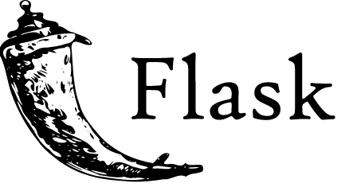
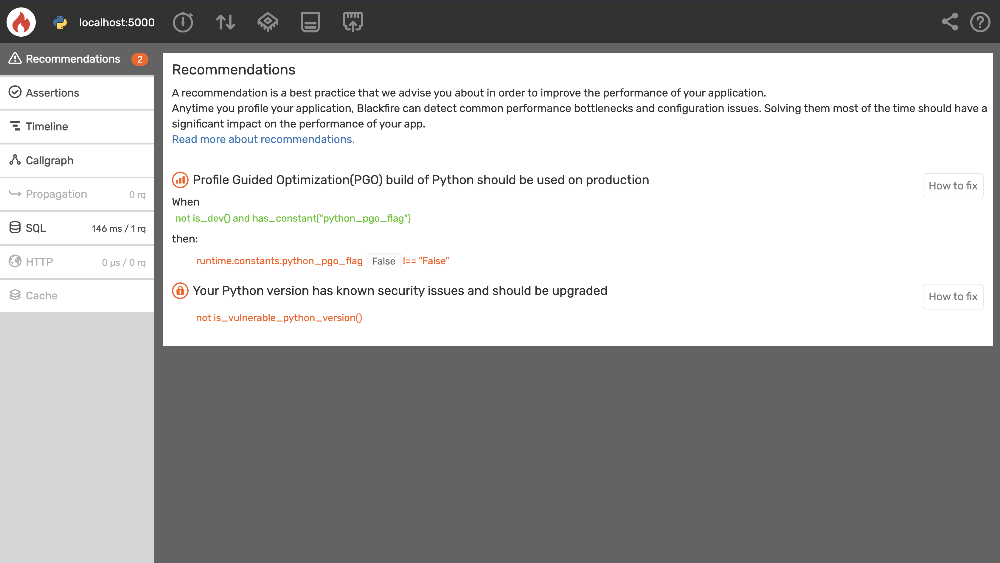

<p align="right">
<a href="https://platform.sh">

</a>
</p>

<p align="center">
<a href="https://flask.palletsprojects.com/en/2.1.x/">

</a>
</p>

<h1 align="center">Deploy Flask on Platform.sh</h1>

<p align="center">
<strong>Contribute, request a feature, or check out our resources</strong>
<br />
<br />
<a href="https://community.platform.sh"><strong>Join our community</strong></a>&nbsp&nbsp&nbsp&nbsp&nbsp&nbsp
<a href="https://docs.platform.sh"><strong>Documentation</strong></a>&nbsp&nbsp&nbsp&nbsp&nbsp&nbsp
<a href="https://platform.sh/blog"><strong>Blog</strong></a>&nbsp&nbsp&nbsp&nbsp&nbsp&nbsp
<a href="https://github.com/platformsh-templates/flask/issues/new?assignees=&labels=bug&template=bug_report.yml"><strong>Report a bug</strong></a>&nbsp&nbsp&nbsp&nbsp&nbsp&nbsp
<a href="https://github.com/platformsh-templates/flask/issues/new?assignees=&labels=feature+request&template=improvements.yml"><strong>Request a feature</strong></a>
<br /><br />
</p>

<p align="center">
<a href="https://github.com/platformsh-templates/flask/issues">

</a>&nbsp&nbsp
<a href="https://github.com/platformsh-templates/flask/pulls">

</a>&nbsp&nbsp
<a href="https://github.com/pallets/flask/blob/main/LICENSE.rst">

</a>&nbsp&nbsp
<br /><br />
<a href="https://console.platform.sh/projects/create-project?template=https://raw.githubusercontent.com/platformsh/template-builder/master/templates/flask/.platform.template.yaml&utm_content=flask&utm_source=github&utm_medium=button&utm_campaign=deploy_on_platform" target="_blank" title="Deploy with Platform.sh"></a>
</p>
</p>

<hr>

<p align="center">
<strong>Contents</strong>
<br /><br />
<a href="#about"><strong>About</strong></a>&nbsp&nbsp&nbsp&nbsp&nbsp&nbsp
<a href="#features"><strong>Features</strong></a>&nbsp&nbsp&nbsp&nbsp&nbsp&nbsp
<a href="#getting-started"><strong>Getting started</strong></a>&nbsp&nbsp&nbsp&nbsp&nbsp&nbsp
<a href="#customizations"><strong>Customizations</strong></a>&nbsp&nbsp&nbsp&nbsp&nbsp&nbsp
<a href="#local-development"><strong>Local Development</strong></a>&nbsp&nbsp&nbsp&nbsp&nbsp&nbsp
<a href="#learn"><strong>Learn</strong></a>&nbsp&nbsp&nbsp&nbsp&nbsp&nbsp
<a href="#blackfireio-creating-a-continuous-observability-strategy"><strong>Blackfire</strong></a>&nbsp&nbsp&nbsp&nbsp&nbsp&nbsp
<a href="#contribute"><strong>Contribute</strong></a>&nbsp&nbsp&nbsp&nbsp&nbsp&nbsp
<br />
</p>

## About

This template demonstrates building the Flask framework for Platform.sh. It includes a minimalist application skeleton that demonstrates how to connect to a MariaDB server for data storage and Redis for caching. The application starts as a bare Python process with no separate runner. It is intended for you to use as a starting point and modify for your own needs.

Flask is a lightweight web microframework for Python.

## Features

-   Python 3.7
-   Flask 2
-   MariaDB 10.4
-   Redis 5.0
-   Automatic TLS certificates
-   Pipfile-based build

## Getting Started

### Deploy

#### Quickstart

The quickest way to deploy this template on Platform.sh is by clicking the button below.
This will automatically create a new project and initialize the repository for you.

<p align="center">
    <a href="https://console.platform.sh/projects/create-project?template=https://raw.githubusercontent.com/platformsh/template-builder/master/templates/flask/.platform.template.yaml&utm_content=flask&utm_source=github&utm_medium=button&utm_campaign=deploy_on_platform">
        
    </a>
</p>
<br/>

#### Other deployment options

For all of the other options below, clone this repository first:

```bash
git clone https://github.com/platformsh-templates/flask
```

If you're trying to deploy from GitHub, you can generate a copy of this repository first in your own namespace by clicking the [Use this template](https://github.com/platformsh-templates/flask/generate) button at the top of this page.

Then you can clone a copy of it locally with `git clone git@github.com:YOUR_NAMESPACE/flask.git`.

<details>
<summary>Deploy directly to Platform.sh from the command line</summary>
<!-- <blockquote>
<br/> -->

1. Create a free trial:

    [Register for a 30 day free trial with Platform.sh](https://auth.api.platform.sh/register). When you have completed signup, select the **Create from scratch** project option. Give you project a name, and select a region where you would like it to be deployed. As for the _Production environment_ option, make sure to match it to this repository's settings, or to what you have updated the default branch to locally.

1. Install the Platform.sh CLI

    #### Linux/OSX

    ```bash
    curl -sS https://platform.sh/cli/installer | php
    ```

    #### Windows

    ```bash
    curl -f https://platform.sh/cli/installer -o cli-installer.php
    php cli-installer.php
    ```

    You can verify the installation by logging in (`platformsh login`) and listing your projects (`platform project:list`).

1. Set the project remote

    Find your `PROJECT_ID` by running the command `platform project:list`

    ```bash
    +---------------+------------------------------------+------------------+---------------------------------+
    | ID            | Title                              | Region           | Organization                    |
    +---------------+------------------------------------+------------------+---------------------------------+
    | PROJECT_ID    | Your Project Name                  | xx-5.platform.sh | your-username                   |
    +---------------+------------------------------------+------------------+---------------------------------+
    ```

    Then from within your local copy, run the command `platform project:set-remote PROJECT_ID`.

1. Push

    ```bash
    git push platform DEFAULT_BRANCH
    ```

<!-- <br/>
</blockquote> -->
</details>

<details>
<summary>Integrate with a GitHub repo and deploy pull requests</summary>
<!-- <blockquote>
<br/> -->

1. Create a free trial:

    [Register for a 30 day free trial with Platform.sh](https://auth.api.platform.sh/register). When you have completed signup, select the **Create from scratch** project option. Give you project a name, and select a region where you would like it to be deployed. As for the _Production environment_ option, make sure to match it to whatever you have set at `https://YOUR_NAMESPACE/flask`.

1. Install the Platform.sh CLI

    #### Linux/OSX

    ```bash
    curl -sS https://platform.sh/cli/installer | php
    ```

    #### Windows

    ```bash
    curl -f https://platform.sh/cli/installer -o cli-installer.php
    php cli-installer.php
    ```

    You can verify the installation by logging in (`platformsh login`) and listing your projects (`platform project:list`).

1. Setup the integration:

    Consult the [GitHub integration documentation](https://docs.platform.sh/integrations/source/github.html#setup) to finish connecting your repository to a project on Platform.sh. You will need to create an Access token on GitHub to do so.

<!-- <br/>
</blockquote> -->
</details>

<details>
<summary>Integrate with a GitLab repo and deploy merge requests</summary>
<!-- <blockquote>
<br/> -->

1. Create a free trial:

    [Register for a 30 day free trial with Platform.sh](https://auth.api.platform.sh/register). When you have completed signup, select the **Create from scratch** project option. Give you project a name, and select a region where you would like it to be deployed. As for the _Production environment_ option, make sure to match it to this repository's settings, or to what you have updated the default branch to locally.

1. Install the Platform.sh CLI

    #### Linux/OSX

    ```bash
    curl -sS https://platform.sh/cli/installer | php
    ```

    #### Windows

    ```bash
    curl -f https://platform.sh/cli/installer -o cli-installer.php
    php cli-installer.php
    ```

    You can verify the installation by logging in (`platformsh login`) and listing your projects (`platform project:list`).

1. Create the repository

    Create a new repository on GitLab, set it as a new remote for your local copy, and push to the default branch.

1. Setup the integration:

    Consult the [GitLab integration documentation](https://docs.platform.sh/integrations/source/gitlab.html#setup) to finish connecting a repository to a project on Platform.sh. You will need to create an Access token on GitLab to do so.

<!-- <br/>
</blockquote> -->
</details>

<details>
<summary>Integrate with a Bitbucket repo and deploy pull requests</summary>
<!-- <blockquote>
<br/> -->

1. Create a free trial:

    [Register for a 30 day free trial with Platform.sh](https://auth.api.platform.sh/register). When you have completed signup, select the **Create from scratch** project option. Give you project a name, and select a region where you would like it to be deployed. As for the _Production environment_ option, make sure to match it to this repository's settings, or to what you have updated the default branch to locally.

1. Install the Platform.sh CLI

    #### Linux/OSX

    ```bash
    curl -sS https://platform.sh/cli/installer | php
    ```

    #### Windows

    ```bash
    curl -f https://platform.sh/cli/installer -o cli-installer.php
    php cli-installer.php
    ```

    You can verify the installation by logging in (`platformsh login`) and listing your projects (`platform project:list`).

1. Create the repository

    Create a new repository on Bitbucket, set it as a new remote for your local copy, and push to the default branch.

1. Setup the integration:

    Consult the [Bitbucket integration documentation](https://docs.platform.sh/integrations/source/bitbucket.html#setup) to finish connecting a repository to a project on Platform.sh. You will need to create an Access token on Bitbucket to do so.

<!-- <br/>
</blockquote> -->
</details>

### Next steps

With your application now deployed on Platform.sh, things get more interesting.
Run the command `platform environment:branch new-feature` for your project, or open a trivial pull request off of your current branch.

The resulting environment is an _exact_ copy of production.
It contains identical infrastructure to what's been defined in your configuration files, and even includes data copied from your production environment in its services.
On this isolated environment, you're free to make any changes to your application you need to, and really test how they will behave on production.

After that, here are a collection of additional resources you might find interesting as you continue with your migration to Platform.sh:

-   [Local development](#local-development)
-   [Troubleshooting](#troubleshooting)
-   [Adding a domain and going live](https://docs.platform.sh/domains/steps.html)
-   [(CDN) Content Delivery Networks](https://docs.platform.sh/domains/cdn.html)
-   [Performance and observability with Blackfire.io](https://docs.platform.sh/integrations/observability/blackfire.html)
-   [Pricing](https://docs.platform.sh/overview/pricing.html)
-   [Security and compliance](https://docs.platform.sh/security.html)

## Customizations

The following files have been added to a basic Flask configuration. If using this project as a reference for your own existing project, replicate the changes below to your project.

-   The `.platform.app.yaml`, `.platform/services.yaml`, and `.platform/routes.yaml` files have been added. These provide Platform.sh-specific configuration and are present in all projects on Platform.sh. You may customize them as you see fit.
-   An additional Pip library, [`platformshconfig`](https://github.com/platformsh/config-reader-python), has been added. It provides convenience wrappers for accessing the Platform.sh environment variables.
-   A rudimentary application is included in `server.py` for demonstration purposes. It shows the basic process of starting the server and connecting to the MariaDB database. Modify and replace it as desired.

## Local Development

Platform.sh provides support for locally running a Flask application that has been deployed on Platform.sh including its services. This means that once you download the code of the Flask project you deployed on Platform.sh, you can make changes to the project without pushing to Platform.sh each time to test them. You can build your app locally using the Platform.sh CLI, even when its functionality depends on a number of services. You can run your Flaks application locally with all of it’s services by following these steps:

-   Download your deployed code by running the following command using the Platform.sh CLI:

    ```bash
    platform get <PROJECT_ID>
    ```

-   Create a new branch. Whenever you develop Platform.sh, you should develop in an isolated environment. This way you aren’t opening SSH tunnels to your production environment. By creating a branch from your default environment, you create a new environment with copies of all production code and data.

    Create an isolated environment named updates by running the following command:

        platform environment:branch updates

-   Expose a port for your application to run on by running the following command in your terminal:

        export PORT=8000

-   Install all the dependencies your application needs.

        pipenv --three install

-   Open a SSH tunnel to the environment’s database and services:

        platform tunnel:open

-   Add an environment variable that contains the service credentials:

    ```bash
    export PLATFORM_RELATIONSHIPS="$(platform tunnel:info --encode)"
    ```

-   Run the application server

        pipenv run python server.py

    Now your Flask app should be running locally with a connection to a remote database that’s separate from your production database.

> **Note:**
>
> For many of the steps above, you may need to include the CLI flags `-p PROJECT_ID` and `-e ENVIRONMENT_ID` if you are not in the project directory or if the environment is associated with an existing pull request.

## Learn

### Troubleshooting

<details>
<summary><strong>Accessing logs</strong></summary><br/>

After the environment has finished its deployment, you can investigate issues that occured on startup, `deploy` and `post_deploy` hooks, and generally at runtime using the CLI. Run the command:

```bash
platform ssh
```

If you are running the command outside of a local copy of the project, you will need to include the `-p` (project) and/or `-e` (environment) flags as well.
Once you have connected to the container, [logs](https://docs.platform.sh/development/logs.html#container-logs) are available within `/var/log/` for you to investigate.

</details>

### Blackfire.io: creating a Continuous Observability Strategy

This template includes a starting [`.blackfire.yml`](.blackfire.yml) file that can be used to enable [Application Performance Monitoring](https://blackfire.io/docs/monitoring-cookbooks/index), [Profiling](https://blackfire.io/docs/profiling-cookbooks/index), [Builds](https://blackfire.io/docs/builds-cookbooks/index) and [Performance Testing](https://blackfire.io/docs/testing-cookbooks/index) on your project. Platform.sh comes with Blackfire pre-installed on application containers, and [setting up requires minimal configuration](https://docs.platform.sh/integrations/observability/blackfire.html).

-   [What is Blackfire?](https://blackfire.io/docs/introduction)
-   [Configuring Blackfire.io on a Platform.sh project](https://docs.platform.sh/integrations/observability/blackfire.html)
-   [Blackfire.io Platform.sh documentation](https://blackfire.io/docs/integrations/paas/platformsh)
-   [Profiling Cookbooks](https://blackfire.io/docs/profiling-cookbooks/index)
-   [Monitoring Cookbooks](https://blackfire.io/docs/monitoring-cookbooks/index)
-   [Testing Cookbooks](https://blackfire.io/docs/testing-cookbooks/index)
-   [Using Builds](https://blackfire.io/docs/builds-cookbooks/index)
-   [Configuring Integrations](https://blackfire.io/docs/integrations/index)

#### Profiling a Flask application

<p align="center" >

</a>
</p>

As mentioned above, this template includes a starting `.blackfire.yaml` file that can be used to activate Blackfire on a project. In other to run a simple profile on this application there following steps are to be carried out:

-   Sign up for a [Blackfire](https://blackfire.io) account and follow the onboarding guide.
    <br>
-   Open a [tunnel](#local-development).
    <br>
-   Using your terminal, install Blackfire and all of it's dependencies using the instructions [here](https://blackfire.io/docs/up-and-running/installation).
    <br>
-   In your terminal, Export the flask application

    ```bash
    export FLASK_APP=server.py
    ```

-   Start the aplication server by running the following command:
    ```bash
    blackfire-python flask run
    ```
    <br>
-   Go to `localhost:5000` or the port you've selected in your browser, with the [Blackfire Browser extension](https://blackfire.io/docs/integrations/browsers/index) click on "Profile"
    <br>

-   A new section at the top of your browser will be displayed to showcase the profiling in progress.
    <br>
    
    <br>

-   After profiling is done, you can click on any of the buttons on that section to see more information about the application profiling results.
    <br>
-   Congratulations, you just profiled a Flask application with Blackfire.

### Resources

-   [Flask](http://flask.pocoo.org/)
-   [Python on Platform.sh](https://docs.platform.sh/languages/python.html)

### Contact

This template is maintained by the Platform.sh Developer Relations team, and they will be notified of all issues and pull requests you open here.

-   **Community:** Share your question with the community, or see if it's already been asked on our [Community site](https://community.platform.sh).
-   **Slack:** If you haven't done so already, you can join Platform.sh's [public Slack](https://chat.platform.sh/) channels and ping the `@devrel_team` with any questions.

### About Platform.sh

This template has been specifically designed to deploy on Platform.sh.

<details>
<summary>What is Platform.sh?</summary><br/>

Platform.sh is a unified, secure, enterprise-grade platform for building, running and scaling web applications. We’re the leader in Fleet Ops: Everything you need to manage your fleet of websites and apps is available from the start. Because infrastructure and workflows are handled from the start, apps just work, so teams can focus on what really matters: making faster changes, collaborating confidently, and scaling responsibly. Whether managing a fleet of ten or ten thousand sites and apps, Platform.sh is the Developer- preferred solution that scales right.

Our key features include:

-   **GitOps: Git as the source of truth**

    Every branch becomes a development environment, and nothing can change without a commit.

-   **Batteries included: Managed infrastructure**

    [Simple abstraction in YAML](https://docs.platform.sh/configuration/yaml.html) for [committing and configuring infrastructure](https://docs.platform.sh/overview/structure.html), fully managed patch updates, and 24 [runtimes](https://docs.platform.sh/languages.html) & [services](https://docs.platform.sh/configuration/services.html) that can be added with a single line of code.

-   **Instant cloning: Branch, merge, repeat**

    [Reusable builds](https://docs.platform.sh/overview/build-deploy.html) and automatically inherited production data provide true staging environments - experiment in isolation, test, then destroy or merge.

-   **FleetOps: Fleet management platform**

    Leverage our public API along with custom tools like [Source Operations](https://docs.platform.sh/configuration/app/source-operations.html) and [Activity Scripts](https://docs.platform.sh/integrations/activity.html) to [manage thousands of applications](https://youtu.be/MILHG9OqhmE) - their dependency updates, fresh content, and upstream code.

To find out more, check out the demo below and go to our [website](https://platform.sh/product/).

<br/>
<p align="center">
<a href="https://platform.sh/demo/"></a>
</p>

</details>

## Contribute

<h3 align="center">Help us keep top-notch templates!</h3>

Every one of our templates is open source, and they're important resources for users trying to deploy to Platform.sh for the first time or better understand the platform. They act as getting started guides, but also contain a number of helpful tips and best practices when working with certain languages and frameworks.

See something that's wrong with this template that needs to be fixed? Something in the documentation unclear or missing? Let us know!

<p align="center">
<strong>How to contribute</strong>
<br /><br />
<a href="https://github.com/platformsh-templates/flask/issues/new?assignees=&labels=bug&template=bug_report.yml"><strong>Report a bug</strong></a>&nbsp&nbsp&nbsp&nbsp&nbsp&nbsp
<a href="https://github.com/platformsh-templates/flask/issues/new?assignees=&labels=feature+request&template=improvements.yml"><strong>Submit a feature request</strong></a>&nbsp&nbsp&nbsp&nbsp&nbsp&nbsp
<a href="https://github.com/platformsh-templates/flaks/pulls"><strong>Open a pull request</strong></a>&nbsp&nbsp&nbsp&nbsp&nbsp&nbsp
<br />
</p>
<br />
<p align="center">
<strong>Need help?</strong>
<br /><br />
<a href="https://community.platform.sh"><strong>Ask the Platform.sh Community</strong></a>&nbsp&nbsp&nbsp&nbsp&nbsp&nbsp
<a href="https://chat.platform.sh"><strong>Join us on Slack</strong></a>&nbsp&nbsp&nbsp&nbsp&nbsp&nbsp
<br />
</p>
<br />
<h3 align="center"><strong>Thanks to all of our amazing contributors!</strong></h3>
<br/>
<p align="center">
<a href="https://github.com/platformsh-templates/flask/graphs/contributors">
  
</a>
</p>

<p align="center">
<em>Made with <a href="https://contrib.rocks">contrib.rocks</a><em>
</p>

<br />
