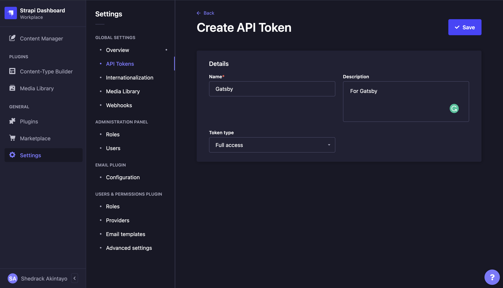
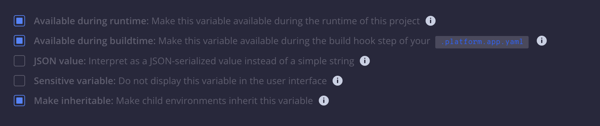

<h1 align="center">Deploy Gatsby and Strapi on Platform.sh</h1>

<p align="center">
<strong>Contribute, request a feature, or check out our resources</strong>
<br />
<br />
<a href="https://community.platform.sh"><strong>Join our community</strong></a>&nbsp&nbsp&nbsp&nbsp&nbsp&nbsp
<a href="https://docs.platform.sh"><strong>Documentation</strong></a>&nbsp&nbsp&nbsp&nbsp&nbsp&nbsp
<a href="https://platform.sh/blog"><strong>Blog</strong></a>&nbsp&nbsp&nbsp&nbsp&nbsp&nbsp
<a href="https://github.com/platformsh-templates/gatsby-strapi/issues/new?assignees=&labels=bug&template=bug_report.yml"><strong>Report a bug</strong></a>&nbsp&nbsp&nbsp&nbsp&nbsp&nbsp
<a href="https://github.com/platformsh-templates/gatsby-strapi/issues/new?assignees=&labels=feature+request&template=improvements.yml"><strong>Request a feature</strong></a>
<br /><br />
</p>

<p align="center">
<a href="https://github.com/platformsh-templates/gatsby-strapi/issues">

</a>&nbsp&nbsp
<a href="https://github.com/platformsh-templates/gatsby-strapi/pulls">

</a>&nbsp&nbsp
</a>&nbsp&nbsp
<br /><br />
<a href="https://console.platform.sh/projects/create-project?template=https://raw.githubusercontent.com/platformsh/template-builder/master/templates/gatsby-strapi/.platform.template.yaml&utm_content=gatsby-strapi&utm_source=github&utm_medium=button&utm_campaign=deploy_on_platfor" target="_blank" title="Deploy with Platform.sh"></a>
</p>
</p>

<hr>

<p align="center">
<strong>Contents</strong>
<br /><br />
<a href="#about"><strong>About</strong></a>&nbsp&nbsp&nbsp&nbsp&nbsp&nbsp
<a href="#features"><strong>Features</strong></a>&nbsp&nbsp&nbsp&nbsp&nbsp&nbsp
<a href="#post-install"><strong>Post Install</strong></a>&nbsp&nbsp&nbsp&nbsp&nbsp&nbsp
<a href="#deploying to platform.sh"><strong>Deploying to Platform.sh</strong></a>&nbsp&nbsp&nbsp&nbsp&nbsp&nbsp
<a href="#customizations"><strong>Customizations</strong></a>&nbsp&nbsp&nbsp&nbsp&nbsp&nbsp
<a href="#local-development"><strong>Local Development</strong></a>&nbsp&nbsp&nbsp&nbsp&nbsp&nbsp
<!-- <a href="#learn"><strong>Learn</strong></a>&nbsp&nbsp&nbsp&nbsp&nbsp&nbsp -->
<!-- <a href="#blackfireio-creating-a-continuous-observability-strategy"><strong>Blackfire</strong></a>&nbsp&nbsp&nbsp&nbsp&nbsp&nbsp -->
<a href="#contribute"><strong>Contribute</strong></a>&nbsp&nbsp&nbsp&nbsp&nbsp&nbsp
<br />
</p>

## About

This template builds a two application project to deploy the Headless CMS pattern using Gatsby as its frontend and Strapi for its backend. The `gatsby-source-strapi` source plugin is used to pull data from Strapi during the `post_deploy` hook into the Gatsby Data Layer and build the frontend site. Gatsby utilizes the Platform.sh Configuration Reader library for Node.js to define the backend data source in its configuration. It is intended for you to use as a starting point and modify for your own needs.

Note that there are several setup steps required after the first deploy to have the full application working. See the included README's post-install section for details.

Gatsby is a free and open source framework based on React that helps developers build blazing fast websites and apps, and Strapi is a Headless CMS framework written in Node.js.

> **Important Informantion, Please Read.**
> For this template to work optimally, there are memory requirements for both applications.
> Gatsby needs at least **500MB** of RAM
> Strapi needs at least **2GB** of RAM

## Features

-   Gatsby 4
-   Strapi 4
-   Node.js 14
-   SQLite 3
-   PostgreSQL 12
-   Automatic TLS certificates
-   yarn-based build
-   Multi-app configuration
-   Delayed SSG build (post deploy hook)

## Post-install

This template was developed with Strapi's [Build a static blog with Gatsby 4 and Strapi tutotial](https://github.com/strapi/strapi-starter-gatsby-blog) to deploy a multi-app project on Platform.sh. After it has deployed however, you will still need to manually set up Strapi's Admin Panel so that the Gatsby frontend application can fully build.

### Create an admin user

Visit the `backend.<generated url>` subdomain. Strapi will direct you to visit the `/admin` path to register an administrative user. You will need to register an admin user before any API endpoints can be created.

### Set up the Template

After you deploy this application and you have registered the admin user, you will have access to the **Admin Panel**.

In other for the gatsby application to work, you'll need to do the following.

-   Go to the **Admin Panel** and register a user
-   Login to the Admin Panel and Create an API Token for Gatsby to use it in order to consume data from Strapi.
    -   Create a Full Access API token in the global settings of your application.
        
    -   Keep the token somewhere as you will need it for your Gatsby application.
-   Create two environment-level variables in your deployed project namely:

    -   `env:STRAPI_TOKEN` - the value for this variable should be the API access token you created via the Strapi Admin Panel.
    -   `env:STRAPI_API_URL` - the value for ths variable should be `backend.<generated url>` subdomain.

    > **Note:**
    >
    > The variables you create should be availble at runtime and build time and they should also be inheritable. Make sure to check these boxes when creating the environment variables.
    > 

-   Immediately you add these variables, your environment will redeploy, wait for it to finish deploying and you can now visit the `main.<generated url>` to see your Gatsby application running.

## Deploying to Platform.sh

Following Strapi v4 release, a bunch of environment variables are now required for Strapi to work correctly. Create a `.environment` file in the Strapi app folder and add the following content.

```bash
export ADMIN_JWT_SECRET="$PLATFORM_PROJECT_ENTROPY"
export JWT_SECRET="$PLATFORM_PROJECT_ENTROPY"
export API_TOKEN_SALT="$PLATFORM_PROJECT_ENTROPY"
export APP_KEYS=$PLATFORM_TREE_ID,$PLATFORM_PROJECT
```

After doing this, please commit the changes and push to Platform.sh for it to take effect.

## Local development

For local development of this template, you need to first install the dependencies for each project by running the `yarn install` command on any of the apps in this template and this will automatically install the required dependencies.

For Gatsby to connect to Strapi, we'll need to visit the Strapi admin panel on our local server and generate a full acess API Token


After creating a new Access Token for Gatsby, we'll need to create a `.env` file that contains the following:

```bash
STRAPI_TOKEN= <the api token you created>
STRAPI_API_URL=http://localhost:1337
```

Start both application server by running the `yarn develop` command. It is advisable to first start the Strapi server before the Gatsby app server.

> **Note:**
>
> The `STRAPI_API_URL` attribute will fail to retrieve posts if it contains a trailing slash, so be sure to exclude it when setting `STRAPI_API_URL`.

## Customizations

The following files and additions make the framework work. If using this project as a reference for your own existing project, replicate the changes below to your project.

-   The `.platform.app.yaml`, `.platform/services.yaml`, and `.platform/routes.yaml` files have been added. These provide Platform.sh-specific configuration and are present in all projects on Platform.sh. You may customize them as you see fit.
-   An additional Platform.sh configuration reader module for [Node.js](https://github.com/platformsh/config-reader-nodejs) has been added. It provides convenience wrappers for accessing the Platform.sh environment variables.
-   `frontend/gatsby-config.js` has been modified to read the Strapi backend url and assign it to the `apiURL` attribute for the `gatsby-source-strapi` plugin. Since routes are not available during the build hook, and since we want this value to be generated and unique on each environment, `gatsby build` runs and pulls in content from the Wordpress app during the `post_deploy` hook on the mounted `public` directory.
-   For Strapi, the `start` command calls the script `backend/start.sh`, which is configured to run Strapi as a development environment, allowing you to create new Content Types once it is deployed, even on the master/production branch of your project. We recommend adjusting this command to run Strapi in `production` mode on the master branch (`start.sh` includes an example environment-specific start command that can be used to accomplish this).

## References

-   [Gatsby](https://www.gatsbyjs.org/)
-   [gatsby-source-strapi on GitHub](https://github.com/strapi/gatsby-source-strapi)
-   [Building a Static Blog using Gatsby and Strapi](https://strapi.io/blog/build-a-static-blog-with-gatsby-and-strapi)
-   [Gatsby CMS with Strapi](https://strapi.io/gatsby-cms)
-   [Strapi](https://strapi.io/)
-   [Node.js on Platform.sh](https://docs.platform.sh/languages/nodejs.html)

### Contact

This template is maintained by the Platform.sh Developer Relations team, and they will be notified of all issues and pull requests you open here.

-   **Community:** Share your question with the community, or see if it's already been asked on our [Community site](https://community.platform.sh).
-   **Slack:** If you haven't done so already, you can join Platform.sh's [public Slack](https://chat.platform.sh/) channels and ping the `@devrel_team` with any questions.

### About Platform.sh

This template has been specifically designed to deploy on Platform.sh.

<details>
<summary>What is Platform.sh?</summary><br/>

Platform.sh is a unified, secure, enterprise-grade platform for building, running and scaling web applications. We’re the leader in Fleet Ops: Everything you need to manage your fleet of websites and apps is available from the start. Because infrastructure and workflows are handled from the start, apps just work, so teams can focus on what really matters: making faster changes, collaborating confidently, and scaling responsibly. Whether managing a fleet of ten or ten thousand sites and apps, Platform.sh is the Developer- preferred solution that scales right.

Our key features include:

-   **GitOps: Git as the source of truth**

    Every branch becomes a development environment, and nothing can change without a commit.

-   **Batteries included: Managed infrastructure**

    [Simple abstraction in YAML](https://docs.platform.sh/configuration/yaml.html) for [committing and configuring infrastructure](https://docs.platform.sh/overview/structure.html), fully managed patch updates, and 24 [runtimes](https://docs.platform.sh/languages.html) & [services](https://docs.platform.sh/configuration/services.html) that can be added with a single line of code.

-   **Instant cloning: Branch, merge, repeat**

    [Reusable builds](https://docs.platform.sh/overview/build-deploy.html) and automatically inherited production data provide true staging environments - experiment in isolation, test, then destroy or merge.

-   **FleetOps: Fleet management platform**

    Leverage our public API along with custom tools like [Source Operations](https://docs.platform.sh/configuration/app/source-operations.html) and [Activity Scripts](https://docs.platform.sh/integrations/activity.html) to [manage thousands of applications](https://youtu.be/MILHG9OqhmE) - their dependency updates, fresh content, and upstream code.

To find out more, check out the demo below and go to our [website](https://platform.sh/product/).

<br/>
<p align="center">
<a href="https://platform.sh/demo/"></a>
</p>

</details>

## Contribute

<h3 align="center">Help us keep top-notch templates!</h3>

Every one of our templates is open source, and they're important resources for users trying to deploy to Platform.sh for the first time or better understand the platform. They act as getting started guides, but also contain a number of helpful tips and best practices when working with certain languages and frameworks.

See something that's wrong with this template that needs to be fixed? Something in the documentation unclear or missing? Let us know!

<p align="center">
<strong>How to contribute</strong>
<br /><br />
<a href="https://github.com/platformsh-templates/gatsby-strapi/issues/new?assignees=&labels=bug&template=bug_report.yml"><strong>Report a bug</strong></a>&nbsp&nbsp&nbsp&nbsp&nbsp&nbsp
<a href="https://github.com/platformsh-templates/gatsby-strapi/issues/new?assignees=&labels=feature+request&template=improvements.yml"><strong>Submit a feature request</strong></a>&nbsp&nbsp&nbsp&nbsp&nbsp&nbsp
<a href="https://github.com/platformsh-templates/gatsby-strapi/pulls"><strong>Open a pull request</strong></a>&nbsp&nbsp&nbsp&nbsp&nbsp&nbsp
<br />
</p>
<br />
<p align="center">
<strong>Need help?</strong>
<br /><br />
<a href="https://community.platform.sh"><strong>Ask the Platform.sh Community</strong></a>&nbsp&nbsp&nbsp&nbsp&nbsp&nbsp
<a href="https://chat.platform.sh"><strong>Join us on Slack</strong></a>&nbsp&nbsp&nbsp&nbsp&nbsp&nbsp
<br />
</p>
<br />
<h3 align="center"><strong>Thanks to all of our amazing contributors!</strong></h3>
<br/>
<p align="center">
<a href="https://github.com/platformsh-templates/gatsby-strapi/graphs/contributors">
  
</a>
</p>

<p align="center">
<em>Made with <a href="https://contrib.rocks">contrib.rocks</a><em>
</p>

<br />
